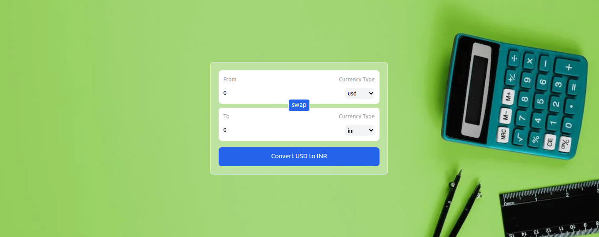

# Currency Convertor

# Description

The Currency Converter App is a web application built using React.js that allows users to quickly and easily convert between different currencies. It provides a user-friendly interface for converting any two currencies using up-to-date exchange rates.

# Features
- Currency conversion between any two currencies.
- Real-time exchange rate data fetched from a reliable source.
- Custom hooks for managing state and handling currency conversion logic.
- Utilizes React hooks including useState, useEffect, and useRef for efficient state management and rendering.
- Styled with Tailwind CSS for a sleek and responsive design.
- Built with Vite for fast loading and an optimal developer experience.

# Demo

You can try out the live demo of the Currency Converter App [here].

# Usage

- Select the base currency from the dropdown list.
- Enter the amount you want to convert.
- Choose the target currency from the second dropdown list.
- The converted amount will be displayed instantly.

# Customization
 You can easily customize this ap by modifying the code. Here are a few suggestions:

 - Add more currencies to the dropdown options.
 - Improve the UI/UX with additional styling or         animations.
 - Enhance error handling for network requests.
 - Implement additional features such as historical exchange rate charts.

